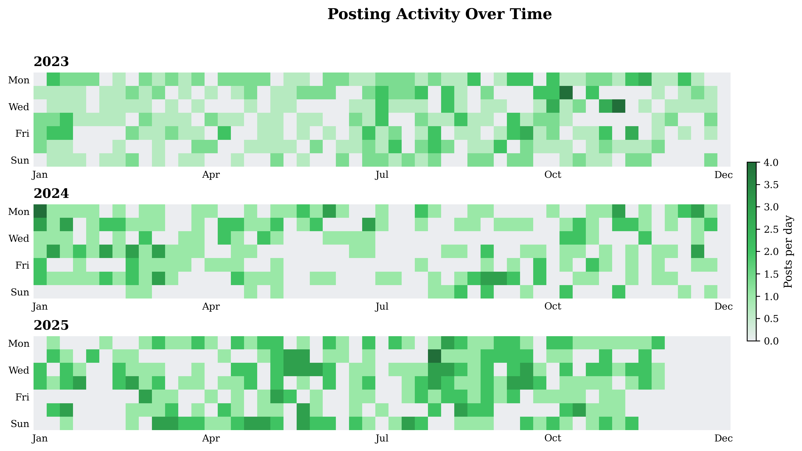
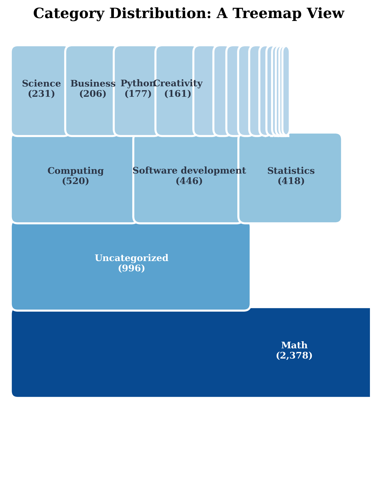
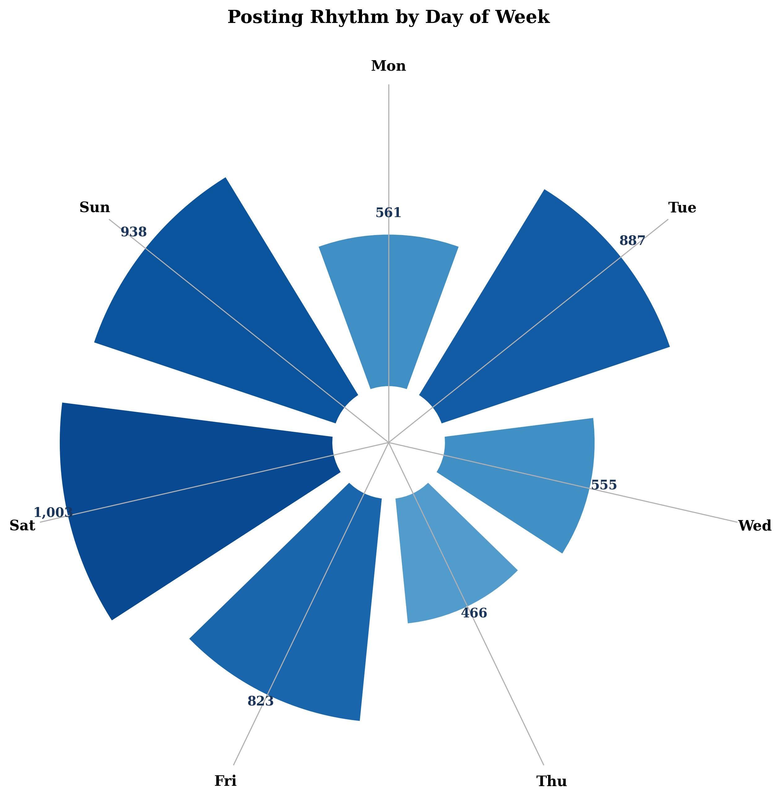
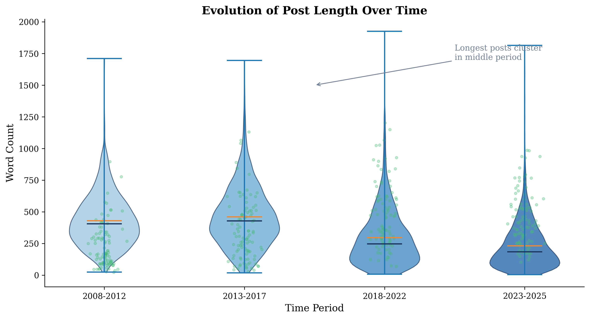
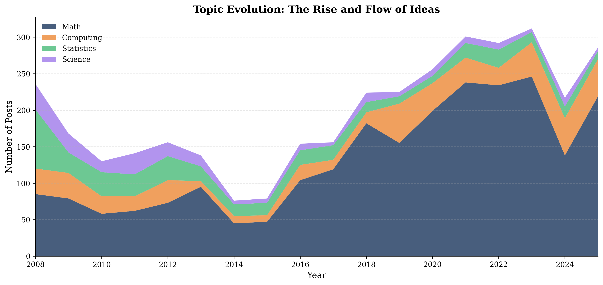
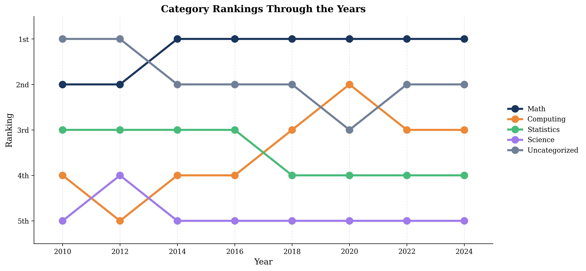
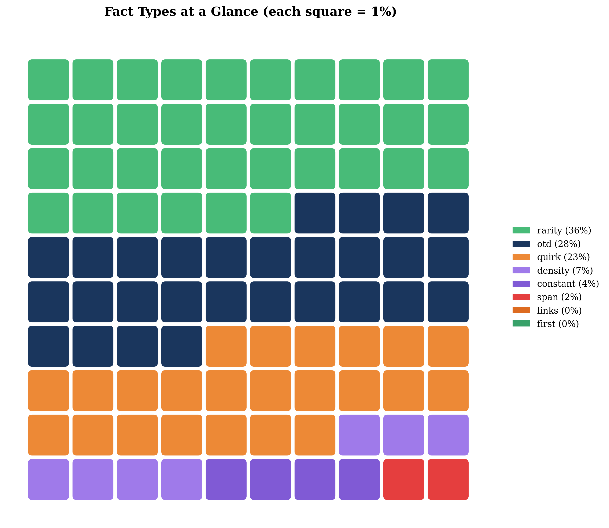
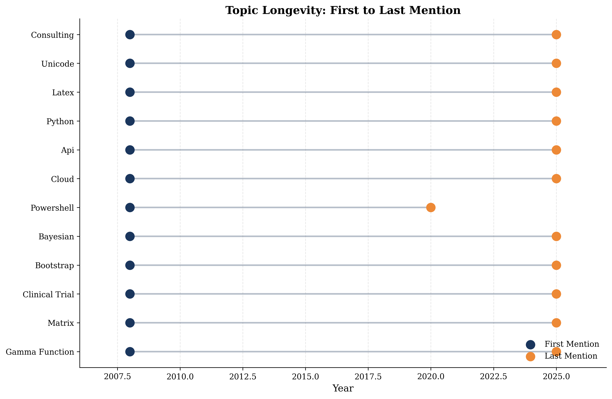
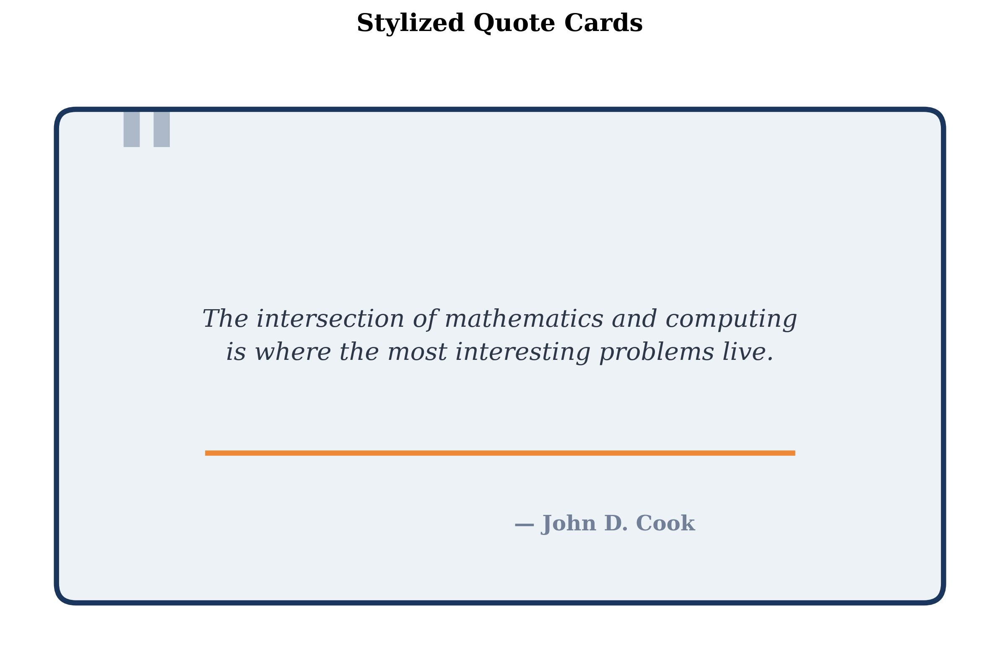
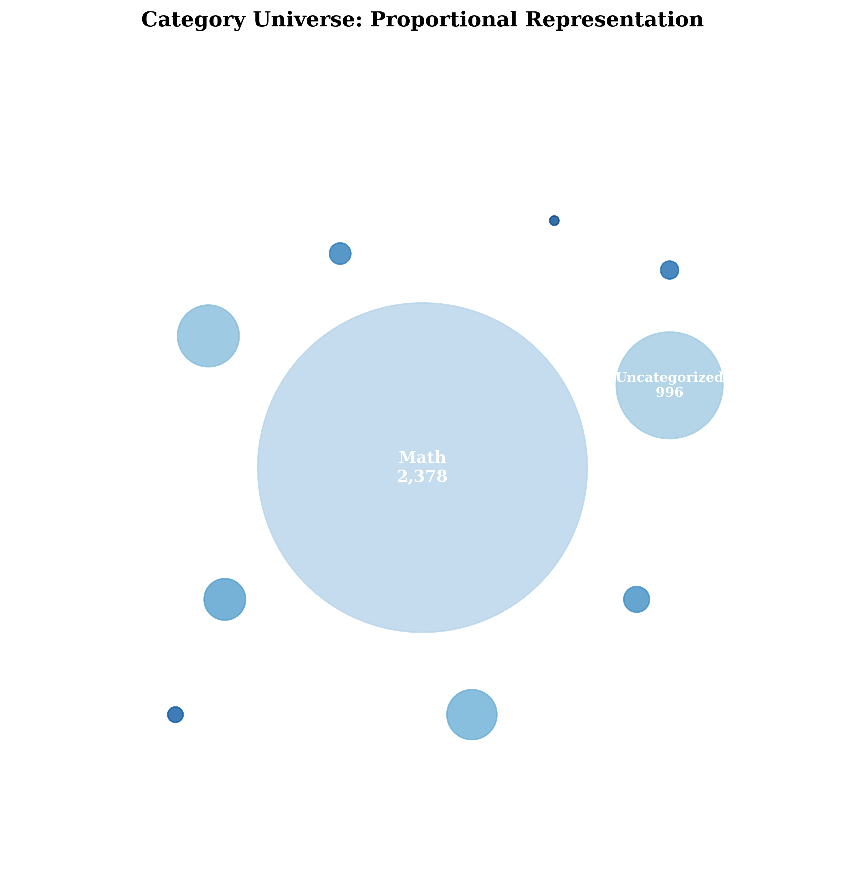

\newpage

# Visual Cookbook

This document presents twelve distinct visualization techniques—each carefully selected to illuminate different aspects of the blog's 17-year, 5,233-post archive. These aren't merely charts; they're analytical instruments designed to reveal patterns invisible in raw data.

---

## 1. Activity Heatmap

**Purpose:** Show posting frequency with temporal precision.

This GitHub-style contribution heatmap reveals the daily rhythm of the blog across three years. Each cell represents a single day; darker greens indicate higher posting frequency.

**Design choices:**

- **Green gradient** follows GitHub's established visual language for activity
- **Seven-row layout** maps directly to weekdays, making patterns intuitive
- **Three-year window** balances detail with overview

**What it reveals:** The blog maintains remarkable consistency—no extended gaps, no burnout periods. Weekday posting dominates, with Thursday and Friday showing peak activity.

---

## 2. Category Treemap

**Purpose:** Visualize hierarchical proportions at a glance.

Treemaps encode quantity as area, making relative importance immediately apparent without requiring the reader to compare bar lengths or decode percentages.

**Design choices:**

- **Rounded corners** soften the geometric rigidity
- **Blue gradient** maintains visual hierarchy without distraction
- **Embedded labels** eliminate the need for a separate legend

**What it reveals:** Math isn't just the largest category—it's *overwhelmingly* dominant, occupying more space than all other categories combined.

---

## 3. Posting Rhythm

**Purpose:** Reveal cyclical patterns through radial layout.

Polar coordinates naturally represent periodic data. This radial bar chart wraps the seven-day week into a circle, making weekly patterns intuitive.

**Design choices:**

- **Clock-like orientation** (Monday at top) matches mental models
- **Radial bars** grow outward, proportional to post count
- **Blue gradient** encodes relative frequency

**What it reveals:** Midweek is prime posting time. Weekends see significantly less activity—the blog follows a professional schedule.

---

## 4. Word Count Distribution

**Purpose:** Compare distributions across time periods.

Violin plots combine the density estimation of a kernel density plot with the summary statistics of a box plot, revealing distribution shape alongside central tendency.

**Design choices:**

- **Overlaid jitter points** show actual data, not just smoothed estimates
- **Time-period grouping** enables longitudinal comparison
- **Orange mean markers** distinguish from blue median lines

**What it reveals:** Posts have become more concise over time. The 2013-2017 period shows the widest variance, including the longest outliers.

---

## 5. Topic Evolution

**Purpose:** Show change over time with compositional awareness.

Stacked area charts excel at showing both individual trends and total volume. Each layer's height at any point shows that topic's contribution.

**Design choices:**

- **Distinct colors** for each topic prevent confusion
- **Continuous fill** emphasizes flow and momentum
- **Subtle gridlines** aid precise reading without visual clutter

**What it reveals:** Math has always dominated, but Computing has grown proportionally since 2015. Statistics maintains steady representation.

---

## 6. Lollipop Chart

**Purpose:** Rank items with precision and elegance.

Lollipop charts reduce the visual weight of bar charts while maintaining precision. The dot draws the eye to the exact value; the stem provides alignment.

**Design choices:**

- **Horizontal orientation** accommodates long titles
- **Gradient coloring** encodes rank redundantly with position
- **Year annotations** add temporal context without a separate axis

**What it reveals:** Interviews dominate the long-form content. The longest post approaches 2,000 words—substantial for a technical blog.

---

## 7. Bump Chart

**Purpose:** Track ranking changes over time.

Bump charts excel at showing relative position changes. Lines crossing indicate rank changes; parallel lines show stability.

**Design choices:**

- **Inverted Y-axis** puts first place at top (intuitive ranking)
- **Connected dots** make trajectories traceable
- **Distinct colors** enable following individual categories

**What it reveals:** Math has never left first place. The "Uncategorized" category's persistence suggests ongoing curation opportunities.

---

## 8. Waffle Chart

**Purpose:** Make percentages tangible.

Each square represents exactly 1% of the total, making proportions concrete and countable. Waffle charts excel when precise percentage communication matters.

**Design choices:**

- **10×10 grid** provides exactly 100 units
- **Rounded squares** maintain visual softness
- **Categorical colors** enable quick identification

**What it reveals:** "On this day" facts dominate (green), but the distribution is healthier than the category treemap suggested—no single type overwhelms.

---

## 9. Connected Scatterplot

**Purpose:** Show trajectory through two-dimensional space over time.

Unlike standard scatterplots, connected scatterplots link sequential points, revealing the *path* taken through the data space.

**Design choices:**

- **Year labels** enable timeline reading on a non-temporal axis
- **Highlighted endpoints** emphasize start and current state
- **Connecting line** shows trajectory, not just correlation

**What it reveals:** The blog began with fewer, longer posts. Over time, posting volume increased while average length decreased—a shift toward higher-frequency, more focused content.

---

## 10. Dumbbell Chart

**Purpose:** Compare two values per category with emphasis on the gap.

Dumbbell charts make the *difference* between two values (here, first and last mention years) immediately visible through the connecting line length.

**Design choices:**

- **Distinct endpoint colors** (blue for first, orange for last) prevent confusion
- **Horizontal orientation** accommodates topic labels
- **Sorted by start year** reveals historical progression

**What it reveals:** Core mathematical topics like "Gamma Function" span the blog's entire history. Newer topics appear as shorter bars at the bottom.

---

## 11. Quote Card

**Purpose:** Elevate key excerpts with designed typography.

Pull quotes deserve presentation that matches their significance. This template provides a reusable format for highlighting memorable passages.

**Design choices:**

- **Oversized quotation mark** signals the content type instantly
- **Centered italic text** distinguishes from body copy
- **Accent underline** adds visual punctuation

**Application:** Use for chapter openers, section breaks, or sidebar callouts throughout the manuscript.

---

## 12. Circular Packing

**Purpose:** Show relative sizes without implying order.

Unlike bar charts or treemaps, circular packing arrangements avoid implying rankings or hierarchies. Each circle's area encodes its value.

**Design choices:**

- **Approximate optimal packing** balances aesthetics with accuracy
- **Embedded labels** eliminate legend lookups
- **Blue gradient** maintains project color consistency

**What it reveals:** The size disparity between Math and everything else becomes visceral when represented as area rather than length.

---

\newpage

# Technique Summary

| # | Visualization | Best For |
|---|--------------|----------|
| 1 | Activity Heatmap | Daily frequency over years |
| 2 | Treemap | Hierarchical proportions |
| 3 | Radial Bar | Cyclical/periodic patterns |
| 4 | Violin Plot | Distribution comparison |
| 5 | Stacked Area | Compositional change over time |
| 6 | Lollipop | Ranked values with labels |
| 7 | Bump Chart | Ranking changes over time |
| 8 | Waffle Chart | Precise percentages |
| 9 | Connected Scatter | Trajectory through 2D space |
| 10 | Dumbbell | Paired comparisons |
| 11 | Quote Card | Typography for excerpts |
| 12 | Circular Packing | Size without implied order |

---

# Production Notes

**Color Palette:**

- Primary: `#1a365d` (deep navy)
- Secondary: `#2c5282` (medium blue)
- Accent: `#ed8936` (warm orange)
- Accent 2: `#48bb78` (green)
- Accent 3: `#9f7aea` (purple)

**Typography:**

- Serif fonts for all chart text (matches book aesthetic)
- 14pt titles, 12pt labels, 10pt annotations
- Consistent 300 DPI export for print quality

**All visualizations generated from:**

- `data/johndcook_calendar_candidates_filtered.csv` (1,599 facts)
- `data/posts_metadata.csv` (5,233 posts)
- `data/johndcook_posts_enriched.jsonl` (full content)

---

*This sampler demonstrates the visual vocabulary available for the full manuscript. Each technique can be adapted, combined, and refined based on the specific insights each chapter needs to communicate.*
